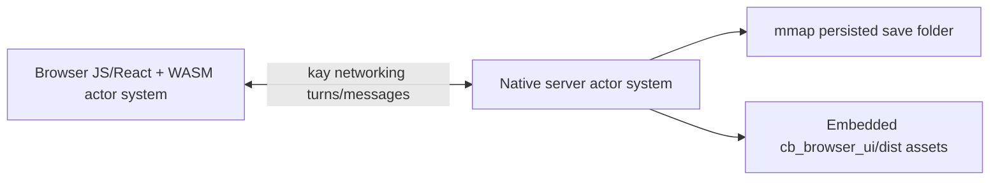
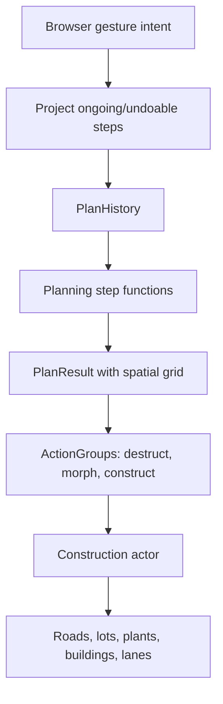

# Citybound Architecture Map

This is an initial source map for the revived fork. It focuses on runtime shape,
actor flow, planning/construction, and modernization risks. It is intentionally
descriptive, not a rewrite proposal.

## Runtime Shape

Citybound has two Rust runtimes:

- The native server binary at `cb_server/main.rs`.
- The browser WASM crate at `cb_browser_ui/src/lib.rs`.

Both runtimes create a `kay::ActorSystem`, register shared simulation actors,
connect `kay` networking, and exchange actor messages. The server owns persisted
simulation state. The browser owns UI actors and render/update subscribers.



## Crate Layout

| Path | Role |
| --- | --- |
| `cb_server` | Native binary, CLI parsing, HTTP asset server, persisted simulation loop. |
| `cb_browser_ui` | Rust/WASM browser actor system plus React/TypeScript UI and Parcel build. |
| `cb_simulation` | Gameplay simulation modules and the shared actor registration/spawn entry points. |
| `cb_planning` | Generic planning model: gestures, projects, plan history, prototype diffing, construction queues. |
| `cb_time` | `Time`, `Temporal`, and `Sleeper` actors. |
| `cb_util` | Logging, deterministic randomness, config management, and server-side config file watching. |

The root Cargo workspace includes server-side crates and explicitly excludes
`cb_browser_ui`, which has its own WASM lockfile/build path.

## Build-Time Actor Codegen

Every Rust crate with actors has the same build script pattern:

```rust
extern crate kay_codegen;
use kay_codegen::scan_and_generate;

fn main() {
    scan_and_generate("src");
}
```

Generated `kay_auto.rs` files are committed throughout the tree. They define
typed actor IDs, trait IDs, message structs, handler registration, spawners, and
trait implementor mappings. Examples:

- `Temporal` implementations get `Into<TemporalID>` mappings.
- `Constructable<CBPrototypeKind>` implementations get `Into<ConstructableID<_>>`
  mappings.
- Browser UI actors implement shared UI traits and `FrameListener`.

Modernization implication: do not delete or regenerate `kay_auto.rs` casually.
First make codegen deterministic and covered by a check that proves generated
output matches committed output.

## Server Boot Flow

`cb_server/main.rs` does this:

1. Parse CLI into `NetworkConfig` and city save folder.
2. Start the browser asset server on a background thread.
3. Create or load the save folder and write/read `__cb_version.txt`.
4. Create `kay::ActorSystem::new_mmap_persisted(...)`.
5. Register actors through `cb_simulation::setup_common`.
6. Call `system.networking_connect()`.
7. Spawn server actors for a new city, or find existing `TimeID` on load.
8. Loop while running:
   - process queued messages
   - advance `Time` unless skipping
   - send/receive network batches
   - finish the networking turn and optionally skip frames

Server persistence is actor-system level, not an explicit save serializer in
Citybound code. The save folder contains mmap-backed actor storage files and a
plain `__cb_version.txt` compatibility marker.

## Browser Boot Flow

`cb_browser_ui/src/lib.rs` exports `start()` to JS through `stdweb`. It:

1. Reads `window.cbNetworkSettings` from the served HTML.
2. Creates `kay::ActorSystem::new(...)` with machine ID `1`.
3. Runs `cb_simulation::setup_common` for shared actor types.
4. Registers browser-only actors:
   - debug/log UI
   - planning UI
   - transport UI
   - time UI
   - land-use UI
   - household UI
   - vegetation UI
5. Connects networking.
6. Spawns browser UI actors.
7. Drives `networking_send_and_receive`, `FrameListener::on_frame`, React state
   updates, and `networking_finish_turn` from `requestAnimationFrame`.

The browser receives network tuning values from `cb_server/browser_ui_server.rs`,
which templates `CB_BATCH_MESSAGE_BYTES`, `CB_ACCEPTABLE_TURN_DISTANCE`, and
`CB_SKIP_TURNS_PER_TURN_AHEAD` into `cb_browser_ui/index.html`.

The browser constructs its simulation address from the page hostname and a
`simulationPort` value templated into `window.cbNetworkSettings` by the server.
This keeps `--bind-sim` port overrides aligned with the browser connection path.

## Shared Actor Registration

`cb_simulation::setup_common` registers the shared runtime model:

- `cb_time::actors`
- `cb_util::log`
- `cb_planning::plan_manager::<CBPlanningLogic>`
- `cb_planning::construction::<CBPrototypeKind>`
- `transport`
- `economy`
- `land_use`
- `environment`

`cb_simulation::spawn_for_server` creates initial server-owned state for new
cities:

- log actor
- time actor
- plan manager
- construction actor
- land-use/building globals
- transport pathfinding globals
- economy market, households, immigration/development
- vegetation setup

The browser does not call `spawn_for_server`. It registers the same shared actor
types so it can receive/send typed messages, then spawns browser UI actors.

## Planning And Construction Flow

The planning system is generic in `cb_planning`, then specialized in
`cb_simulation/src/planning/mod.rs`.



Key pieces:

- `CBGestureIntent` includes road, zone, building, and plant intents.
- `CBPrototypeKind` includes road, lot, and plant prototypes.
- `CBPlanningLogic::planning_step_functions()` runs:
  - `transport::transport_planning::calculate_prototypes`
  - `land_use::zone_planning::calculate_prototypes`
  - `environment::vegetation::calculate_prototypes`
- `PrototypeID` is deterministic from hashed influences.
- `PlanResult` keeps prototypes plus a spatial grid for efficient diffing.
- `PlanResult::actions_to` produces destruct, morph, and construct groups.
- `Construction<CBPrototypeKind>` queues groups and executes them from its
  `Temporal::tick` implementation once pending constructables have reported
  completion.

Modernization implication: early tests should target `PrototypeID`,
`PlanHistory`, `PlanResult::actions_to`, and one small planning step before any
toolchain or dependency rewrite changes behavior.

## Core Actor Families

| Family | Main files | Notes |
| --- | --- | --- |
| Time | `cb_time/src/actors` | `Time` broadcasts `Temporal::tick` and wakes `Sleeper` actors by scheduled instant. |
| Planning | `cb_planning`, `cb_simulation/src/planning` | Generic planning plus Citybound-specific intent/prototype enums. |
| Transport | `cb_simulation/src/transport` | Lanes, switch lanes, construction, pathfinding, trips, UI render messages, and microtraffic. |
| Land use | `cb_simulation/src/land_use` | Zone planning, vacant lots, buildings, procedural architecture, render data, UI messages. |
| Economy | `cb_simulation/src/economy` | Market, household kinds, offers/tasks, immigration, and development manager. |
| Environment | `cb_simulation/src/environment/vegetation` | Plant planning, construction, rendering, and vegetation UI messages. |
| Browser UI | `cb_browser_ui/src/*_browser` | Browser actors implement UI traits and frame listeners, then bridge to JS/React/Monet. |
| Utility | `cb_util/src/log`, `cb_util/src/config_manager` | Actor-based logs and config manager/file watcher. |

## Browser Rendering Bridge

The browser Rust crate exposes frame listeners and UI actors that translate
simulation actor updates into JS state or render payloads. `browser_utils`
contains unsafe flattening helpers for `michelangelo` vertices/instances into
typed arrays. Rendering is ultimately handled by the TypeScript/WebGL `monet`
dependency and React UI code.

Modernization implication: `stdweb` replacement is not just a package swap. The
Rust-to-JS boundary includes exported functions, `js!` blocks, typed arrays,
React state mutation, and WebGL/Monet mesh data.

## Persistence And Versioning

Persistence is centered on `kay::ActorSystem::new_mmap_persisted`, using the
city folder as storage root. Citybound itself writes `__cb_version.txt` from the
build-time `.version` file and warns when the save version differs.

Open risks:

- Actor storage layout likely depends on `compact`, `chunky`, and generated
  actor type IDs.
- `kay::External` fields are used for non-persisted server runtime state such as
  file watchers.
- Save migration/versioning is not visible as an application-level layer.

Modernization implication: changing actor registration order, generated actor
names, `Compact` layouts, or storage crates can break saves even if Rust still
compiles.

## First Safety-Net Targets

The smallest high-value checks appear to be:

1. Pure Rust unit tests for deterministic `PrototypeID` generation.
2. Unit tests for `PlanHistory::update_for` and `apply_update`.
3. Unit tests for `PlanResult::actions_to` using a tiny test-only
   `PrototypeKind`.
4. A server asset smoke that proves `cb_browser_ui/dist/index.html` exists before
   `build-server-debug-compat`.
5. A runtime smoke that uses default sim port `9999` or injects custom sim port
   into the browser template before testing real browser connection.

## Open Questions

- Can `kay_codegen` be run in a mode that verifies output without rewriting
  files?
- Which actor type IDs are persisted, and are they order-dependent?
- Is the hardcoded browser simulation port historical intentional behavior or a
  forgotten CLI plumbing gap?
- How much of `monet` should be treated as Citybound engine code versus a
  replaceable renderer dependency?
- Can browser UI actors be tested outside a full `stdweb`/WASM build?
